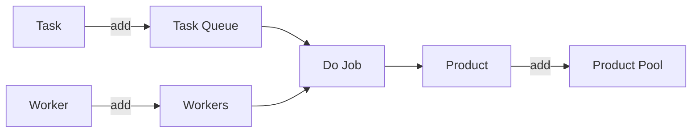

### 工厂

现实生活中，存在大大小小的工厂，他们提供特定的服务，根据用户的需求生产、加工出产品，交付给客户，并赚取服务费。

通常，我们只需要交给工厂一份图纸，工厂就会根据图纸来生产产品，而生产的过程我们是无需关心的，作为客户，我们只关心这间工厂什么时候把产品交付给我们。

类似的，在代码里我们也会存在以下场景：主流程代码将需要做的事情分成一件件任务，并交由对应的代码工厂去执行，这里的任务可以是代码逻辑的执行步骤，而最基本的代码工厂就是各种方法。合并起来，代码工厂执行任务，实际上就是调用方法执行业务逻辑。

不过有时我们期望代码工厂能够异步执行任务，这样主流程就不用一直等待它执行完成了：让互相之间不存在依赖的任务并行执行能大大缩短总体的执行时间。

Java 提供了线程机制允许我们将方法调用放在与主流程独立的线程中执行，不过直接使用线程代码写起来略为繁琐，线程本身也是较低层的概念，所以在 JDK 1.5 之后，提供了对异步任务执行的高层抽象：线程池，通过线程池我们可以更方便的执行异步任务，而不必关心线程的使用细节。

线程池以清晰的设计与简洁的代码优雅的封装了线程并实现了任务执行逻辑。阅读它的代码，就好像走进了一间虚拟的工厂，工人挥舞工具的画面似乎就在眼前。

### 工厂的代码抽象

试想一间最简陋的工厂至少需要些什么才可以正常运转？

- 工人：干活
- 老板：获得订单，安排生产

老板不断地获取订单任务，将订单任务分发给工人，工人按照订单要求，一个接一个的生产产品，最后交付。



那么，映射到代码里，假如我们想要实现一间代码工厂，我们可能会这样设计：

```java
class Factory {
  taskQueue: Queue<Task>;
  workers: Collection<Worker>;
  productPool: Map<Task, Product>;
  
  submit(t: Task) {
    taskQueue.push(t);
  }
  
  run() {
    while (true) {
      t: Task = taskQueue.pop();
      w: Worker = workers.getAvailable();
      p: Product = w.doJob(t);
      productPool.put(t, p);
      w.setAvailable();
    }
  }
}

class Worker {
  doJob(t: Task) -> Product {
    ... ...
  }
}
```

整个工厂的运转就是一个大循环，在循环中取出一个待完成的任务，并取出一个空闲的工人，最后将任务执行结果输出到产品池中。其中工人的工作方式 `doJob` 根据具体业务要求来实现。

上述代码中每一次都必须等待工人执行完任务才能再次循环，这中设计同一时间只有一名工人在工作，这是不合理的，因此稍作改动，将工人干活的部分放到独立的线程中，即可实现高效运转：

```java
... ...
    while (true) {
      t: Task = taskQueue.pop();
      w: Worker = workers.getAvailable();
      new Thread(
      	() -> {
          p: Product = w.doJob(t);
          productPool.put(t, p);
          w.setAvailable();
        }
      ).start();
    }
... ...
```

### Java 任务工厂：线程池

本质上讲，Java 的 `ThreadPoolExecutor` 其工作原理和前文所述的流程基本一致，`ThreadPoolExecutor` 本身可类比为工厂，在工厂内定义了以下成员及方法：

```java
public class ThreadPoolExecutor extends AbstractExecutorService {
    ... ...
    private final BlockingQueue<Runnable> workQueue;
    private final HashSet<Worker> workers = new HashSet<>();
  
    public void execute(Runnable command) {
  	  ... ...
      if (isRunning(c) && workQueue.offer(command)) {
        ... ...
      }
    }
  
    final void runWorker(Worker w) {
        ... ...
        while (task != null || (task = getTask()) != null) {
          ... ...
            try {
              beforeExecute(wt, task);
              try {
                task.run();
                afterExecute(task, null);
              } catch (Throwable ex) {
                afterExecute(task, ex);
                throw ex;
              }
            } finally {
              task = null;
              w.completedTasks++;
              w.unlock();
            }
        }
        ... ...
    }
    ... ...
}
```

可以看到，任务队列由 `BlockingQueue<Runnable>` 定义，工人集合由 `HashSet<Worker>` 定义，`execute(Runnable)` 方法将任务入队，而实际的 `runWorker(Worker)` 方法，在 `whiile` 循环内执行 `task.run()` 来真正的执行任务（实际代码中通过在 `Worker` 线程内调用 `runWorker()` 来实现异步执行）。

从以上视角来看，`ThreadPoolExecutor` 的确与前一节描述的设计大体一致，唯一不同之处在于他并没有提供存放任务执行结果的产品池，实际当中是将任务封装为 `FutureTask` 以委托其进行结果的存储与关联。

#### 工厂运行细节 -- 初始化工厂


####工厂运行细节 -- 创建工人


#### 工厂运行细节 -- 生命周期

